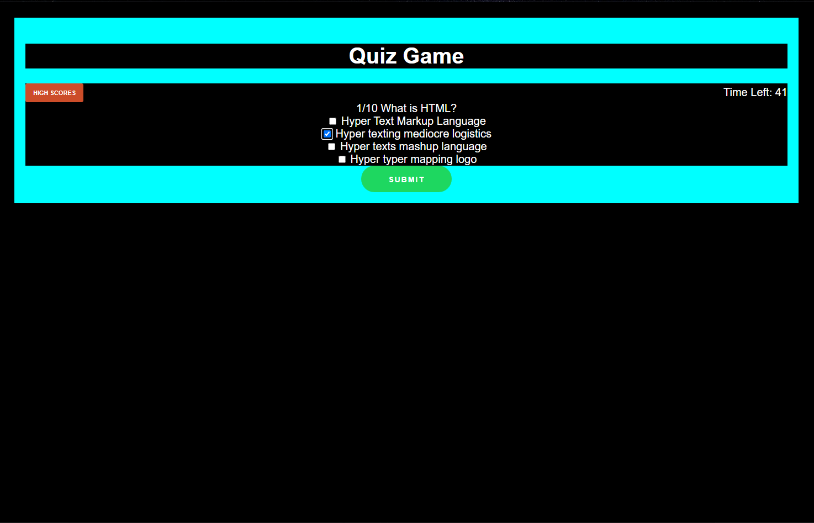
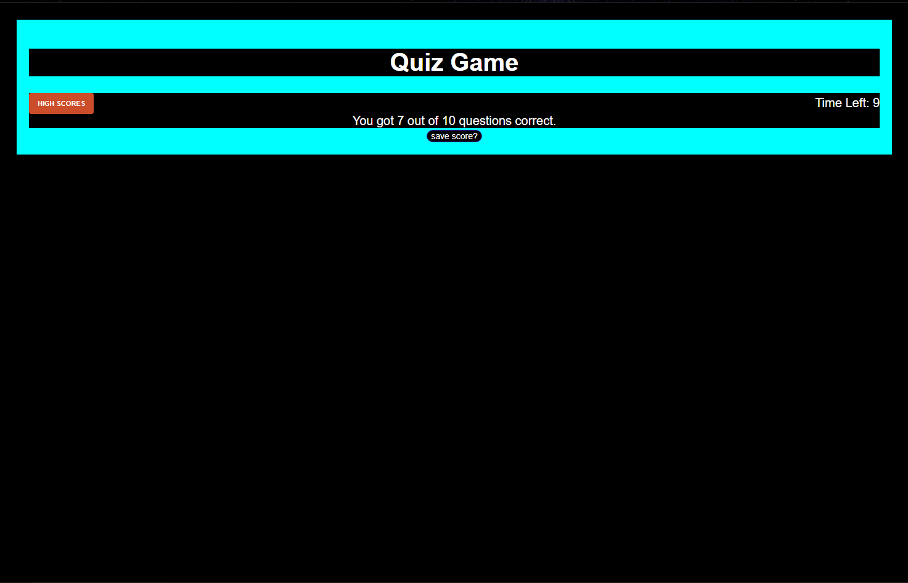
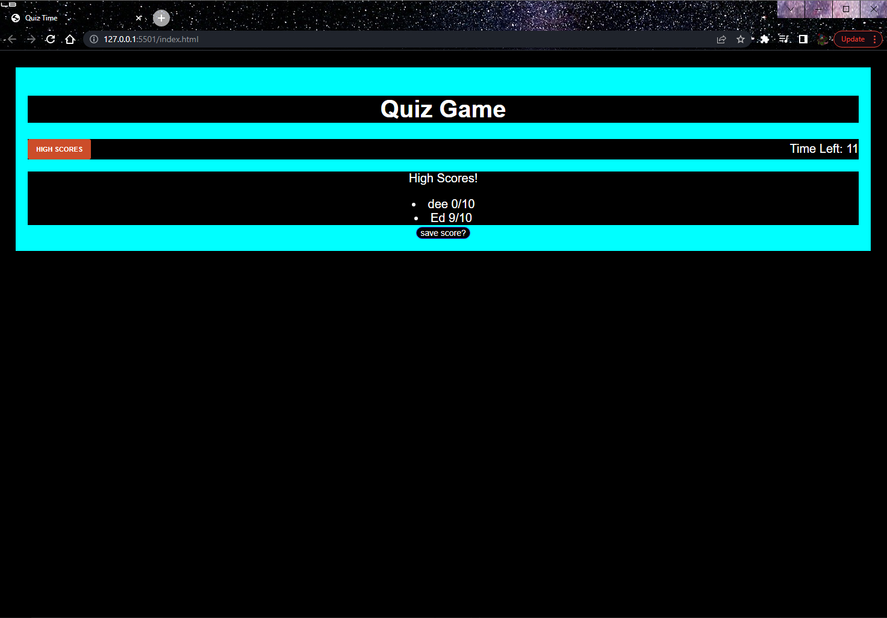

# Timed quiz game
A timed quiz that runs in your browser!

Deployed project
[here](https://edv07.github.io/Timed-quiz/) !

## About
This is a JavaScript-based quiz application with a timer that displays the current question and saves the user's score to local storage. When the timer runs out, the quiz will automatically end and the user's score will be displayed.

## Features
Displays a series of multiple-choice questions with answers
Tracks the user's score and displays it at the end of the quiz
Timer counts down from a specified time and ends the quiz when it reaches zero
Allows users to save their scores and compare them with others

# Getting Started
To run the quiz, simply open the index.html file in a web browser. To start the quiz, simply click the "Start Quiz" button. The first question will be displayed, along with a list of possible answers.

## Answering Questions
To answer a question, select one or more of the available answers and click the "Submit" button. The application will automatically move to the next question, and your score will be updated based on whether or not you answered correctly.

## Viewing the Current Question
At any time during the quiz, you can view the current question by looking at the "Question" section of the application. This section will display the current question number, as well as the text of the question and a list of possible answers.

# screenshots

